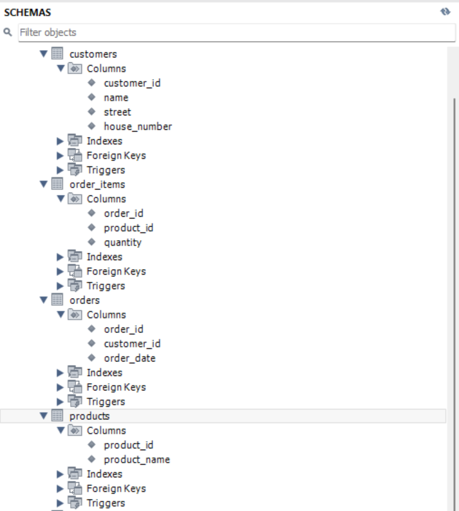

# woolf-rdb-hw-02

## 🤖 Ненормалізована (початкова) таблиця

| Номер_замовлення | Назва_товару і кількість      | Адреса_клієнта   | Дата_замовлення  | Клієнт      |
|------------------|-------------------------------|------------------|------------------|-------------|
| 101              | Лептоп: 3, Мишка: 2           | Хрещатик 1       | 2023-03-15       | Мельник     |
| 102              | Принтер: 1                    | Басейна 2        | 2023-03-16       | Шевченко    |
| 103              | Мишка: 4                      | Комп’ютерна 3    | 2023-03-17       | Коваленко   |

---

## ✅ Перша нормальна форма (1NF)

| Номер_замовлення | Назва_товару  | Кількість | Адреса_клієнта   | Дата_замовлення  | Клієнт      |
|------------------|---------------|-----------|------------------|------------------|-------------|
| 101              | Лептоп        | 3         | Хрещатик 1       | 2023-03-15       | Мельник     |
| 101              | Мишка         | 2         | Хрещатик 1       | 2023-03-15       | Мельник     |
| 102              | Принтер       | 1         | Басейна 2        | 2023-03-16       | Шевченко    |
| 103              | Мишка         | 4         | Комп’ютерна 3    | 2023-03-17       | Коваленко   |

---

## ✅ Друга нормальна форма (2NF)

#### 🔹 Таблиця `customers`

| customer_id | name      | address        |
|-------------|-----------|----------------|
| 1           | Мельник   | Хрещатик 1     |
| 2           | Шевченко  | Басейна 2      |
| 3           | Коваленко | Комп’ютерна 3  |

#### 🔹 Таблиця `products`

| product_id | product_name |
|------------|--------------|
| 1          | Лептоп       |
| 2          | Мишка        |
| 3          | Принтер      |

#### 🔹 Таблиця `orders`

| order_id | customer_id | order_date |
|----------|-------------|-------------|
| 101      | 1           | 2023-03-15  |
| 102      | 2           | 2023-03-16  |
| 103      | 3           | 2023-03-17  |

#### 🔹 Таблиця `order_items`

| order_id | product_id | quantity |
|----------|------------|----------|
| 101      | 1          | 3        |
| 101      | 2          | 2        |
| 102      | 3          | 1        |
| 103      | 2          | 4        |

**Пояснення переходу з 1NF у 2NF:**

- Винесли клієнтів в окрему таблицю `customers`
- Товари — в окрему таблицю `products`
- Замовлення — в таблицю `orders`, що пов’язана з клієнтом
- Склад замовлення — у `order_items`, що зв'язує замовлення і продукти

---

## ✅ Третя нормальна форма (3NF)

#### 🔹 Таблиця `customers` (з деталізацією адреси)

| customer_id | name      | street         | house_number  |
|-------------|-----------|----------------|---------------|
| 1           | Мельник   | Хрещатик       | 1             |
| 2           | Шевченко  | Басейна        | 2             |
| 3           | Коваленко | Комп’ютерна    | 3             |

#### 🔹 Таблиця `products`

| product_id | product_name |
|------------|--------------|
| 1          | Лептоп       |
| 2          | Мишка        |
| 3          | Принтер      |

#### 🔹 Таблиця `orders`

| order_id | customer_id | order_date |
|----------|-------------|-------------|
| 101      | 1           | 2023-03-15  |
| 102      | 2           | 2023-03-16  |
| 103      | 3           | 2023-03-17  |

#### 🔹 Таблиця `order_items`

| order_id | product_id | quantity |
|----------|------------|----------|
| 101      | 1          | 3        |
| 101      | 2          | 2        |
| 102      | 3          | 1        |
| 103      | 2          | 4        |

**Пояснення переходу з 2NF у 3NF:**

- **Розбили поле `address` на окремі атрибути:**
  - `street` (вулиця)
  - `house_number` (номер будинку)

- **Усунули транзитивну залежність:**
  - тепер кожне з цих полів (`street`, `house_number`) безпосередньо залежить лише від `customer_id`, а не один від одного

---

## 📎 Додаткові матеріали до завдання

### 🖼️ 4. ER-діаграма

- ✅ Скриншот ER-діаграми зі звʼязками між таблицями:  

  

> Відображає зв’язки між таблицями `customers`, `orders`, `order_items`, `products`. Зв’язки мають типи one-to-many з урахуванням зовнішніх ключів.

---

### 🧩 5. Схема бази даних у MySQL Workbench

- ✅ Скриншот реалізованої схеми таблиць з колонками, типами даних і звʼязками:  

> Таблиці створено вручну згідно з 3NF. Усі зв’язки між таблицями визначені через FOREIGN KEY.

---

### 💾 SQL-структура

- ✅ [SQL-файл зі створенням таблиць](./script.sql)

> Містить інструкції `CREATE TABLE` з визначенням первинних ключів, зовнішніх ключів і типів даних для всіх таблиць згідно з 3NF.
📌 SQL-файл збережено окремо для зручності перевірки
---

